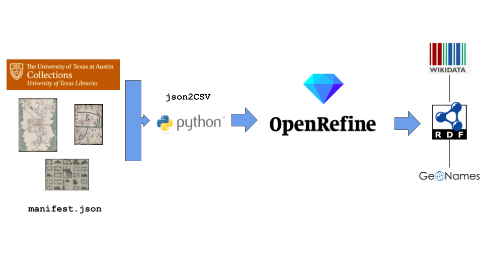
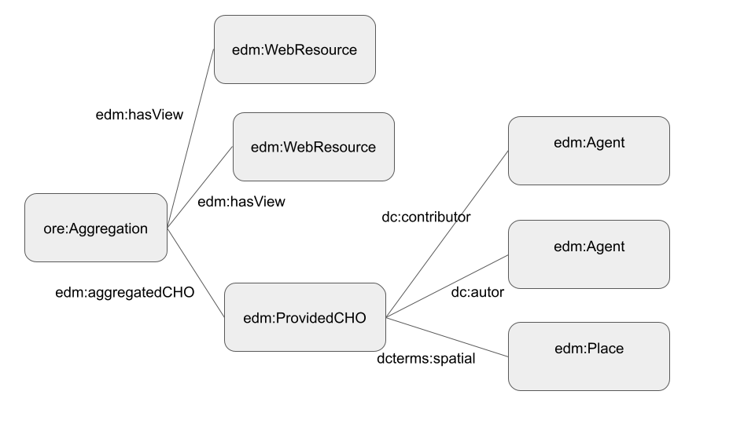
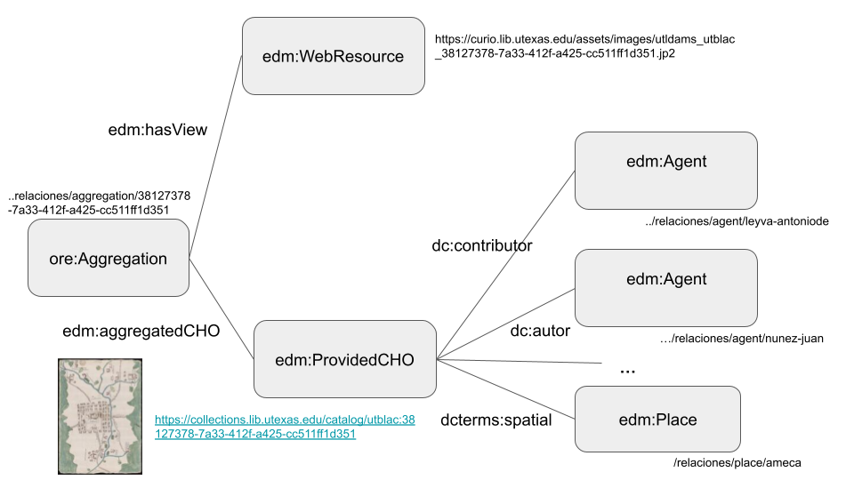

# UCA-relacionesgeograficas
UCA collection relaciones geográficas

### Introducción

Proyecto para la extracción y transformación de la colección digital Relaciones Geográficas a un modelo semántico basado en el vocabulario [European Data Model](https://pro.europeana.eu/page/edm-documentation).

En este prototipo se han seleccionado [81 obras](input/manifests.txt) a través de sus manifests en formato JSON de la colección [Relaciones Geográficas of Mexico and Guatemala](https://collections.lib.utexas.edu/?f%5Bmods_relatedItem_titleInfo_title_source_t%5D%5B%5D=Relaciones+Geogr%C3%A1ficas+of+Mexico+and+Guatemala). 
El [dataset](rdf/relaciones_uca.rdf) se ha transformado al formato RDF siguiendo el vocabulario EDM.

El prototipo incluye las [modificaciones realizadas para la transformación a RDF con la herramienta Open Refine](openrefine/openrefine-steps.json). También se ha desarrollado un [Jupyter Notebook](https://nbviewer.org/github/hibernator11/UCA-relacionesgeograficas/blob/main/notebooks/EjemplosSPARQL.ipynb) que se puede ejecutar en la plataforma Binder.

### Proceso de transformación a RDF
El proceso de transformación a RDF funciona en cuatro pasos: 

- Identificación de recursos a través de sus manifest.json
- Transformación a un fichero tabulado CSV
- Modelado de datos RDF a través del vocabulario EDM con la herramienta OpenRefine 
- Enriquecimiento con repositorios externos como Wikidata y GeoNames

### Scripts
- UCAmanifests2CSV.py: transforma los manifests (json) presentes en el fichero (input/manifests.txt)[input/manifests.txt] a un fichero CSV.
- rdfAnalisis.py: realiza consultas SPARQL al repositorio creado tras el proceso de transformación.

### Modelo de datos con EDM

### Roles autoridad
Los textos originales para los autores incluyen el rol con el que se asigna el autor. Siguiendo los roles que ofrece EDM, se ha realizado el siguiente mapeo:

- creator: signer, artist
- contributor: interpreter, collector, scribe, contributor, witness

Otros posibles modelos:
- https://data.bnf.fr/vocabulary/roles/
- http://www.rdaregistry.info/Elements/a/#P50204

### Clases (Europeana Data Model y otros...)
- void:Dataset https://txarchives.org/utlac/finding_aids/00056.xml
- edm:Place
- ore:Aggregation
- edm:ProvidedCHO
- edm:WebResource

### URLs patterns
- https://unlockingarchives.com/relaciones/place/papantladeolarte
- https://unlockingarchives.com/relaciones/aggregation/50098d40-75e0-4f70-8622-6c156da2e45d
- https://unlockingarchives.com/relaciones/cho/50098d40-75e0-4f70-8622-6c156da2e45d
- https://unlockingarchives.com/relaciones/agent/gutierrezdeliebana-juan

### Enriquecimiento

- dc:coverage http://vocab.getty.edu/aat/300404510 (sixteenth century)
- edm:hasType http://vocab.getty.edu/aat/300028233 (historical maps)

### Pendiente
- Usar skos:Concept para materias. Ahora se usa dc:subject con el texto completo. Sería necesario dividir las conceptos de las materias.
- Enriquecer los autores con identificadores externos como wikidata/viaf
- Enriquecer los lugares con identificadores de GeoNames
- edm:Place dividir en country-state-city skos:prefLabel 
- Establecer roles
- Completar relaciones de autores
- Añadir texto, anotaciones? https://pro.europeana.eu/files/Europeana_Professional/Share_your_data/Technical_requirements/EDM_profiles/EDM_Annotation_Profile_v1.2.pdf
- Espacio de nombres https://unlockingarchives.com/? O usar nodos internos en el fichero RDF para evitar 404. O también podemos responder a esas URLs de alguna forma.

### Referencias

- https://pro.europeana.eu/files/Europeana_Professional/Share_your_data/Technical_requirements/EDM_Documentation/EDM_Mapping_Guidelines_v2.4_102017.pdf
- https://pro.europeana.eu/files/Europeana_Professional/Share_your_data/Technical_requirements/EDM_profiles/IIIFtoEDM_profile_042016.pdf (IIIF EDM extension guidelines)
- https://www.loc.gov/bibframe/docs/bibframe2-model.html
